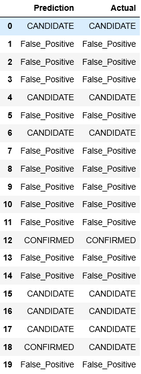

## Classification of Candidate Exoplanet Based on Kepler Observations
Evaluating different machine learning model to classify candidate exoplanet from NASA raw data-set

### Data Source
Kaggle : https://www.kaggle.com/nasa/kepler-exoplanet-search-results

### Background
Over a period of nine years in deep space, the NASA Kepler space telescope has been out on a planet-hunting mission to discover hidden planets outside of our solar system. Kepler has verified 3000 exoplants as of october 2017. The dataset is a cumulative record of all observed Kepler. The records includes approximately 10,000 exoplanet candidates Kepler has taken observations on. 
This dataset has an extensive data dictionary, which can be accessed [here](https://exoplanetarchive.ipac.caltech.edu/docs/API_kepcandidate_columns.html).

### Goal
Evaluate different machine learning model to predict new exoplanets based on Kepler observation data 
Identify a model with best prediction capacity

### Method and Observation
The data was first divided into train(60%), test(20%) and validation data(20%). Logistic Regression, RandomForest, Multilayer perceptron, Support Vector Machine, and Deep-Learning model explored on train-data. Model prediction was examined by fitting the test data, and model-accuracy was examined on validation data. Deep Learning and RandomForest has the highest accuracy 0.9 and it was also better at predicting new exoplanets.

### Prediction
Out of 20 test data the RandomForest only misidentified one test data  

### Repository navigation
Models_evaluate consist of all the jupyter notebooks with model evaluation 
1) DeepLearning-model.ipynb 
2) logistic_model.ipynb 
3) SVM_model.ipynb 

Saved models for future use 
1) DL_model.pkl  
2) LR_model.pkl 
3) MLP_model.pkl 
4) RF_model.pkl 

Data 
1) exoplanet_data.csv (Principal-data) 
2) test_features.csv (test-x_value) 
3) test_labels.csv (test-y_value) 
4) val_features.csv (validation-x_value) 
5) val_labels.csv (validation-y_value) 
4) train_features.csv (train-x_value) 
4) train_labels.csv (train-y_value) 

